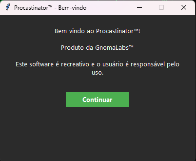
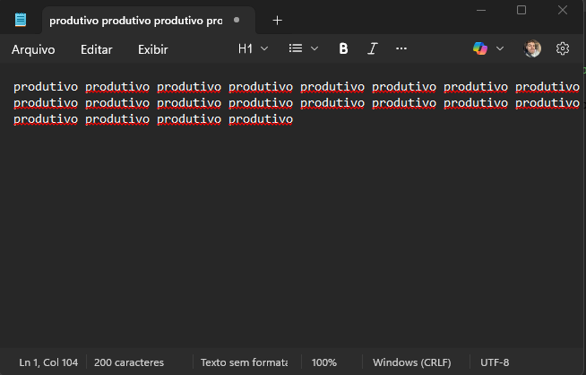

# 💤 Procastinator™

O **Procastinator™** é um bot recreativo com interface gráfica feito em Python que simula atividade no computador, mantendo seu status como "online" em ferramentas como Microsoft Teams.

Ele move o mouse em intervalos aleatórios e digita “produtivo” no Bloco de Notas para parecer que você está... produtivo. 😌

---

## 🧰 Funcionalidades

- Interface interativa em Tkinter
- Movimento automático e aleatório do mouse
- Abertura do Bloco de Notas com digitação contínua de “produtivo”
- Sons ao iniciar e parar
- Tela de loading e boas-vindas
- Menu de configurações personalizáveis

---

## 🚀 Como usar

1. Instale os requisitos:
```bash
pip install pyautogui pillow
```
## ▶️ Como executar

Execute o arquivo principal com:

```bash
python procastinator.py
```

## 🧭 Como funciona o Procastinator™

Veja abaixo o passo a passo do funcionamento do aplicativo:

---

### 1. Tela de boas-vindas
Ao abrir o programa, você verá uma mensagem simpática lembrando que o uso é recreativo.



---

### 2. Interface principal
Você pode iniciar, pausar, configurar ou sair a qualquer momento.

- **Iniciar**: ativa o bot
- **Parar**: desativa o bot
- **Configurações**: ajusta os intervalos e ativa/desativa sons


---

### 3. Funcionamento automático
Ao clicar em "Iniciar", o programa:

- Abre o Bloco de Notas
- Dá foco à janela
- Começa a digitar “produtivo” em loop para simular atividade
- Move o mouse aleatoriamente de tempos em tempos



---

Tudo isso acontece de forma automática, sem que você precise mexer em nada depois de iniciar.


